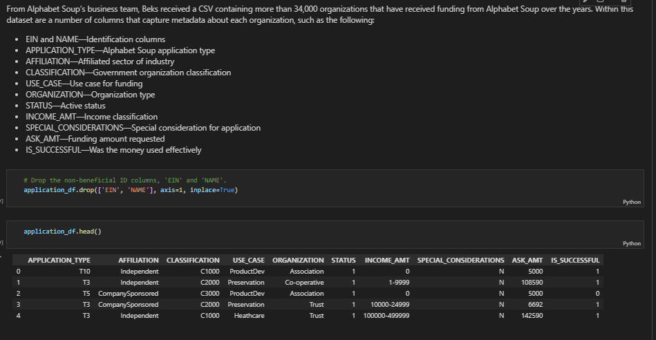
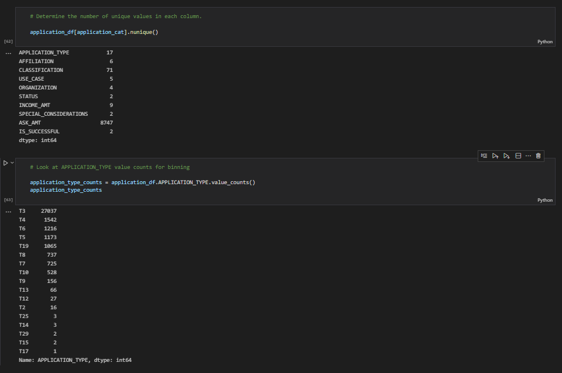
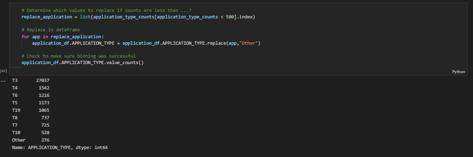
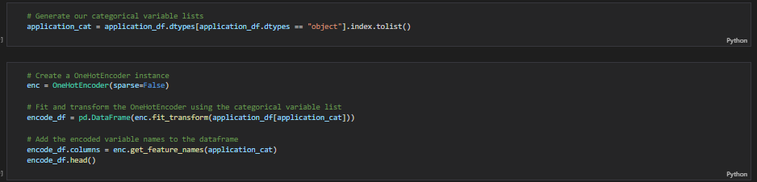
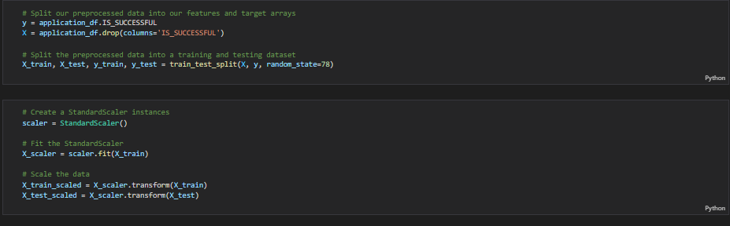
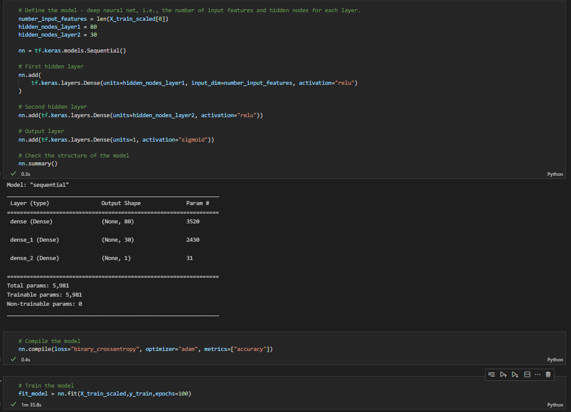
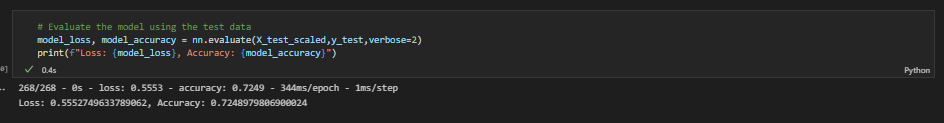
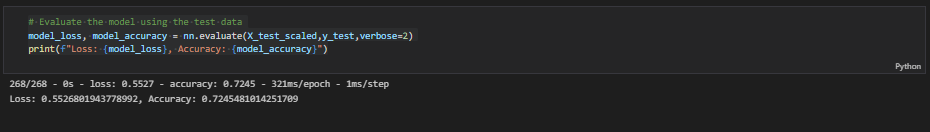
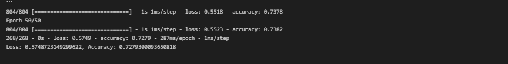

# Neural_Network_Charity_Analysis

## Overview of the analysis
The purpose of this analysis is to develop a deep learning model to aid AlphabetSoup, a philantrophic organization that donates funds to various organizations whose goals align with their charter, in vetting donation applications to best determine where to place their money. The target accuracy of the model is 75%.    

Using machine learning and neural networks, the features in the provided dataset are used to help create a binary classifier that is capable of predicting whether applicants will be successful if funded by Alphabet Soup.  

Alphabet Soup’s business team has provided a CSV containing more than 34,000 organizations that have received funding from Alphabet Soup over the years. Within this dataset are a number of columns that capture metadata about each organization, such as the following:

- EIN and NAME—Identification columns
- APPLICATION_TYPE—Alphabet Soup application type
- AFFILIATION—Affiliated sector of industry
- CLASSIFICATION—Government organization classification
- USE_CASE—Use case for funding
- ORGANIZATION—Organization type
- STATUS—Active status
- INCOME_AMT—Income classification
- SPECIAL_CONSIDERATIONS—Special consideration for application
- ASK_AMT—Funding amount requested
- IS_SUCCESSFUL—Was the money used effectively

From the dataset the target and features for the model are determined and the analysis consisting of three technical deliverables are presented in the results section:

1) Deliverable 1: Preprocessing Data for the Neural Network Model
2) Delivarable 2: Compile, Train, and Evaluate the Model
3) Delivarable 3: Optimize the Model

The results of the deep learning model are summarized and a recomendation for how a different model can solve this classification model is provided.  

## Resources
- Data source: charity_data.csv
- Software: Visual Studio 1.63.2, Jupyter Notebook 6.4.6, Python 3.7.11, tensorflow 2.7.0, scikit-learn 1.0, pandas 1.3.4

## Results

### Data Preprocessing

- The data was inspected and the preprocessing began by dropping the two unnecessary columns "EIN" and "NAME" that were considered unuseful for predicting the success of a donation.  

- The target variable for the model is the "IS_SUCCESSFUL" column as this is the column that indicates whether a donation is successful or not.
- The feature variables include the following:
    - APPLICATION_TYPE—Alphabet Soup application type
    - AFFILIATION—Affiliated sector of industry
    - CLASSIFICATION—Government organization classification
    - USE_CASE—Use case for funding
    - ORGANIZATION—Organization type
    - STATUS—Active status
    - INCOME_AMT—Income classification
    - SPECIAL_CONSIDERATIONS—Special consideration for application
    - ASK_AMT—Funding amount requested
 
    Many of the features are later converted to "dummy variables" using the "one hot encoder" method.  The actual number of input features used by the nueral network ended up being 43 based on the 9 features listed above. 

- The number of unique values in each column is determined using the nunique() method to identify columns with more than 10 unique values.  The two categorical variables "APPLICATION_TYPE" and "CLASSIFICATION" with > 10 unique values are identified as needing bucketing into an "other" column to decrease the number of dummy columns that would result when converting these categorical variables to a numerical format.  

- The "APPLICATION_TYPE" column is shown for illustration purposes and the same procedure used on the "CLASSIFICATION" column. As shown in the image above the value counts for the "APPLICATION_TYPE" column is determined. The code below puts all types with less than 500 unique values into "Other".  

- A list is created that contains only categorical types and the "one hot encoder" is used to create the dummy variables.  After which all variables are in numerical format which is required to implement the neural network.  

- Next the preprocessed data is split into features and target arrays, split into a training and testing dataset, and the data is scaled.

### Compiling, Training, and Evaluating the Model

The initial model created using keras neural network library is shown below.  The input for the neural network has 43 features with the output set to one nueron.  Two times the number of inputs was used as a starting point to set the number of neurons (set to 80) for the first hidden layer.  The second hdden layer 30 neurons is chosen to provide adequate processing without overfitting the model.  Both layers use the "relu" activation function with the output layer using the "sigmopid" function for s binary classification of the result of 0 for unsuccessful and 1 for successful prediction.  

- The initial neural network model design results in an accuracy score of 72.5% with a loss of 55.5%.  The initial result is below the 75% target so the model will need to be optimized which is detailed in the next section. 

### Optimize the Model

Optimization Attempt #1
- Drop the STATUS column
- Reduce epochs to 50
- Minimal change in accuracy 72.5%

Optimization Attempt #2
- Drop the STATUS column
- Reduce epochs to 50
- CHANGE output layer activation to tanh
- CHANGE number of neurons
- Slight improvement of 0.4% in accuracy to 72.8% 

Optimization Attempt #1
- Drop the STATUS column
- Reduce epochs to 20
- Add additional layer with 20 nuerons
- Minimal change in accuracy 72.6%

## Summary
A moderately performing binary classifier to predict whether loaning to potential applicants will produce successful results was created using a deep neural network machine learning model.  From the analysis the model failed to reach the accuracy goal of 75% with multiple optimization attempts with the 72.8% being the highest level of accuracy acheived after multiple optimization attempts.  It is recommended that an ensemble-based random forest classifier be evaluated as an alternative model as it handles tabular nonlinear data well, is faster than a neural network, and is robust against overfitting.  